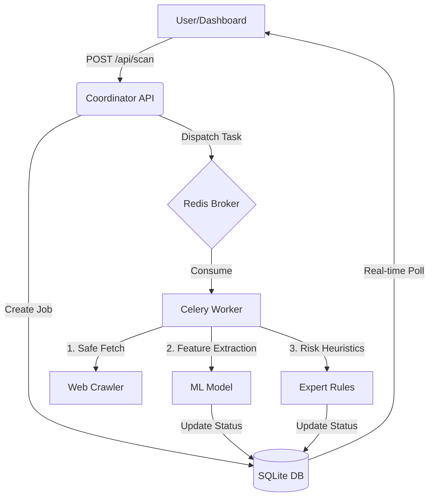

# 🛡️ NovaShield

> **Intelligent, scalable threat detection for the modern web.**

Welcome to **NovaShield**, a highly responsive, distributed cybersecurity system designed to autonomously detect malicious and phishing websites. By combining a distributed crawling architecture with robust Machine Learning classification, NovaShield evaluates URLs in real time to keep users safe from evolving web threats.

---

### 🧠 Intelligence Core
NovaShield is trained on the **[UCI Phishing Websites Dataset](https://archive.ics.uci.edu/ml/datasets/Phishing+Websites)**, a gold-standard academic repository containing over **11,000 expert-verified samples**. This ensures our AI brain is built on rigorous, real-world cybersecurity evidence.

---

## 🏗️ Project Architecture

NovaShield is built as a suite of modular microservices:

*   **`coordinator/`**: A FastAPI REST API that manages the job queue and dispatches tasks.
*   **`worker/`**: Distributed Celery workers that execute asynchronous web crawls using `aiohttp`.
*   **`ml/`**: The Machine Learning pipeline, featuring feature extraction and ensemble classification.
*   **`dashboard/`**: A sleek, Cyberpunk-themed React + Vite frontend for real-time monitoring.
*   **`data/`**: Local SQLite databases for persistence of job states and scan history.

---

## 🔄 System Flow & Pipeline

NovaShield follows a multi-stage pipeline to transform a raw URL into a comprehensive security verdict.

### 1. The Detection Pipeline
Every URL submitted to the system passes through four specialized intelligence layers:

1.  **Safety & Crawling Layer**: The `Worker` performs a safe, asynchronous fetch of the website content, enforcing **SSRF Protection** to block scans of internal networks.
2.  **Structural Extraction Layer**: The `FeatureExtractor` maps the URL and HTML into a 17-dimension vector based on the UCI standard (SSL status, TLD risk, anchor ratios, etc.).
3.  **Linguistic Analysis Layer**: The `NLP Analyzer` scans body text and scripts for high-risk phishing keywords and patterns.
4.  **Inference & Heuristics Layer**: 
    *   **ML Ensemble**: A combination of Random Forest, Gradient Boosting, and Logistic Regression calculates the base probability.
    *   **Risk Rules**: A final "Expert System" layer applies penalties for brand impersonation and suspicious lexical patterns.

### 2. Data Flow Diagram



---

---

## 🚀 Getting Started

### 📋 Prerequisites

*   **Docker & Docker Compose** (Recommended for easiest setup)
*   **Python 3.11+**
*   **Node.js 20+**

---

### ⚡ Quick Start (Docker Compose)
The fastest way to get NovaShield running with all its microservices.

```bash
# 1. Clone the repository
git clone https://github.com/AmrAhmedNady/NovaShield-final-distributed.git
cd NovaShield-final-distributed

# 2. Spin up the entire stack
docker-compose up --build
```
*Access the Dashboard at: [http://localhost:5173](http://localhost:5173)*

---

### 🛠️ Mode 1: Direct Mode (Local Development)
Ideal for debugging and contributing to the code.

#### 1. Setup Environment
```bash
# Install Python dependencies
pip install -r requirements.txt

# Train the initial ML model
python train_model.py

# Install Frontend dependencies
cd dashboard
npm install
cd ..
```

#### 2. Start Services (In separate terminals)

**Terminal 1: Redis Broker**
```bash
docker run -d -p 6379:6379 --name ns-redis redis:7-alpine
```

**Terminal 2: Coordinator API**
```bash
python -m uvicorn coordinator.api:app --host 0.0.0.0 --port 8000 --reload
```

**Terminal 3: Celery Worker**
```bash
python -m celery -A worker.worker_main.celery_app worker --pool=solo --loglevel=info
```

**Terminal 4: Dashboard**
```bash
cd dashboard
npm run dev
```

---

### 🚀 Mode 2: Distributed Mode (Scaling Workers)
When using Docker Compose, you can easily scale your workers to handle more load.

```bash
# Scale to 5 worker instances
docker-compose up -d --scale worker=5
```

#### Management Commands
*   **Stop System**: `docker-compose down`
*   **View Logs**: `docker-compose logs -f`
*   **Reset Data**: `rm -rf data/*.db` (Caution: deletes scan history)

## 🔒 Service Reference

| Service | Mode | URL |
| :--- | :--- | :--- |
| **Dashboard** | Both | [http://localhost:5173](http://localhost:5173) |
| **API Backend** | Both | [http://localhost:8000](http://localhost:8000) |
| **API Docs (Swagger)**| Both | [http://localhost:8000/docs](http://localhost:8000/docs) |
| **Redis Broker** | Docker | `localhost:6379` |

---

## 🧪 Quick Test
Once the system is running, you can verify the new **Heuristic Risk Rules** by scanning a high-risk URL like:
`http://paypa1-secure-verify.xyz/login/account/secure/index.exe`

---

Developed with ❤️ for a safer web.
